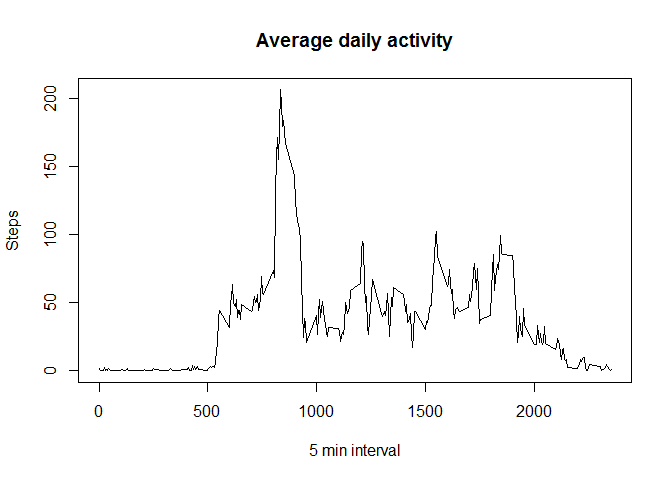
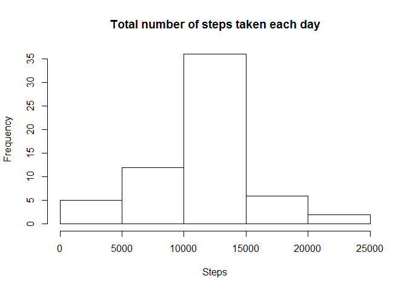

# Reproducible Research: Peer Assessment 1


## Loading and preprocessing the data

```r
#load dependenciess
library(lubridate, warn.conflicts = FALSE)
```

```
## Warning: package 'lubridate' was built under R version 3.4.1
```

```r
library(lattice, warn.conflicts = FALSE)
```


```r
data<-read.csv("activity.csv")

data$date<-ymd(data$date)
```

## What is mean total number of steps taken per day?


```r
steps_by_date<-aggregate(steps~date, data=data,FUN=sum)
hist(steps_by_date$steps, main = 'Total number of steps taken each day', xlab = 'Steps')
```

<!-- -->

Next lets calculate steps mean and median:


```r
steps_mean = mean(steps_by_date$steps)
steps_median = median(steps_by_date$steps)
```

Result:
 Steps mean is 10766.19 and Steps median is 10765


## What is the average daily activity pattern?


```r
steps_by_interval<-aggregate(steps~interval, data=data,FUN=mean)

plot(steps_by_interval$interval, steps_by_interval$steps, main = 'Average daily activity', xlab = '5 min interval', ylab = 'Steps', type = 'l')
```

<!-- -->

Now lets find interval with maximum number of steps


```r
max_interval_index<-which.max(steps_by_interval$steps)
max_interval <- steps_by_interval[max_interval_index,]
```

Result interval with maximum steps is 835 with 206.1698113 steps


## Imputing missing values

1. First find total number of missing rows:


```r
  num_missing_rows = sum(is.na(data$steps))
```
Result: 2304 rows with missing data.

2. Next fill all missing values with average value of same interval


```r
na_data<-data[is.na(data$steps),]
data[is.na(data$steps),'steps'] <-sapply(na_data$interval, function(x){  steps_by_interval[steps_by_interval$interval==x,2]})
#now create plot with fixed data frame

steps_by_date<-aggregate(steps~date, data=data,FUN=sum)
hist(steps_by_date$steps, main = 'Total number of steps taken each day', xlab = 'Steps')
```

<!-- -->


3. Recalculate mean and median values


```r
steps_mean = mean(steps_by_date$steps)
steps_median = median(steps_by_date$steps)
```

Result:
 Steps mean is 10766.19 and Steps median is 10766.19 as we see mean values is the same, but median changed.

## Are there differences in activity patterns between weekdays and weekends?


```r
#Creating new column wd which indicate weekend or weekday

data<-transform(data, wd= ifelse(wday(date) %in% c(7,1), 'weekend', 'weekday'))

# Make a plot

steps_by_interval = aggregate(steps ~ interval + wd, mean, data = data)

xyplot(steps ~ interval | wd, data = steps_by_interval, type = "l", xlab = "Interval", ylab = "Number of steps", layout = c(1, 2))
```

<!-- -->
